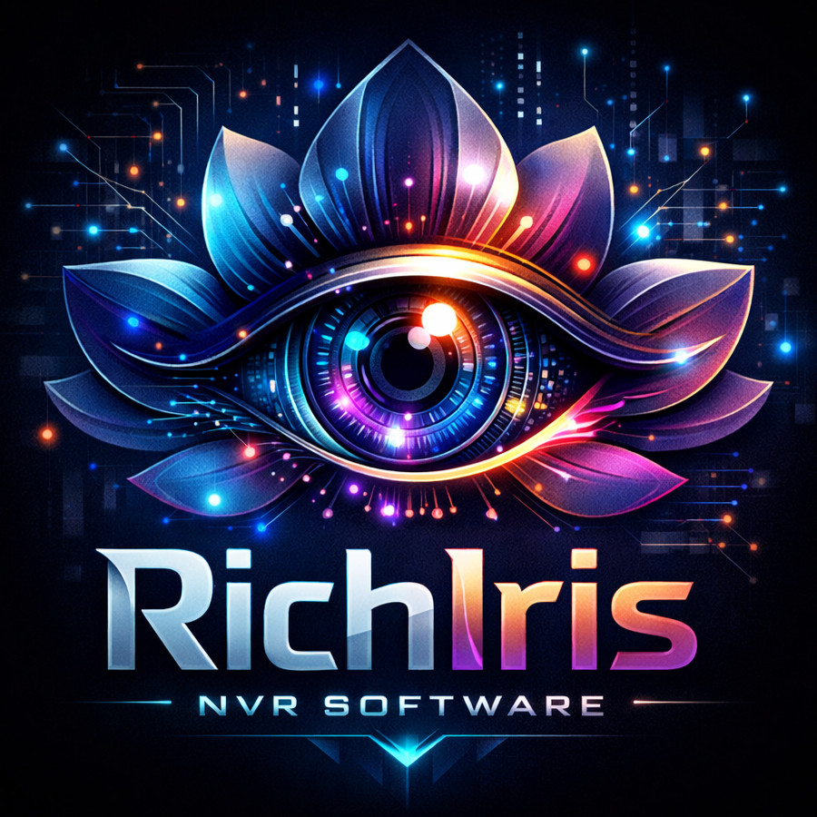

<p align="center">
  
</p>

# RichIris NVR

A self-hosted NVR (Network Video Recorder) for 24/7 recording of RTSP cameras with live view, timeline playback, trickplay thumbnails, motion detection, and AI object detection. Free and open source.

[](https://ko-fi.com/richard1912)

## Features

- **24/7 continuous recording** -- HEVC passthrough (no transcode, no GPU usage) into 15-minute segments
- **Live view** -- low-latency HTTP fMP4 via go2rtc with multi-quality streaming (Direct/High/Low/Ultra Low)
- **Timeline playback** -- zoomable 24h timeline, instant seek, speed controls (1x to 32x), date picker
- **Trickplay thumbnails** -- hover/scrub preview on timeline
- **Motion detection** -- per-camera sensitivity, timeline overlay, configurable script triggers
- **AI object detection** -- YOLO11x for persons, vehicles, and animals with color-coded timeline bars
- **Clip export** -- select a time range and export an MP4
- **Retention management** -- configurable max age and max storage, oldest recordings purged first
- **Native apps** -- Windows desktop and Android client
- **Runs as a Windows service** -- auto-starts on boot

## Quick Start

### 1. Download and install

Download the latest `RichIris-Setup.exe` from [Releases](https://github.com/richard1912/RichIris/releases).

The installer will:
- Install the RichIris backend and desktop app
- Ask you to choose a **data directory** for recordings, database, and logs (pick a drive with plenty of space)
- Download required dependencies (FFmpeg, go2rtc, YOLO model) automatically
- Install and start the RichIris Windows service

### 2. Add cameras

Open the RichIris app (desktop shortcut or Start Menu). On first launch, enter the server address -- `http://localhost:8700` if running on the same machine.

Go to **Settings** and add your cameras with their RTSP URLs. Cameras start recording immediately once added.

### 3. Android client (optional)

Download `RichIris-Android.apk` from [Releases](https://github.com/richard1912/RichIris/releases) and install it on your Android device. Enter your server's IP address (e.g., `http://192.168.1.100:8700`) to connect.

## Requirements

- **Windows 10/11** (64-bit)
- RTSP-capable IP cameras
- Sufficient storage for recordings (varies by camera count and retention settings)
- **Optional**: NVIDIA GPU for AI object detection acceleration (falls back to CPU)

## Configuration

All settings are managed through the app's **System Settings** screen:

| Section | What it controls |
|---------|-----------------|
| **General** | Timezone |
| **Storage** | Data directory (recordings, database, logs, thumbnails) |
| **Retention** | Max recording age (days), max storage (GB) |
| **Trickplay** | Enable/disable timeline thumbnail previews |
| **Logging** | Log level |

The data directory and port are also stored in `bootstrap.yaml` next to the application (editable if needed before first launch).

## Architecture

```
Flutter App (Windows/Android)
    |
    v
FastAPI backend (:8700) --> go2rtc (:1984) <-- RTSP cameras
    |
    v
SQLite DB + Recordings + Thumbnails
```

- **Recording**: One FFmpeg process per camera, codec passthrough (no transcode), 15-minute `.ts` segments
- **Live view**: go2rtc receives RTSP streams and serves HTTP fMP4, proxied through the backend with pre-fetch buffering for instant playback
- **Playback**: Direct mode serves raw segments instantly. Other quality tiers transcode on-the-fly via NVENC
- **AI detection**: Snapshot-based pipeline -- motion pre-filter, then YOLO inference only when motion detected

## Video Quality

| Quality | Live View | Playback | Server Load |
|---------|-----------|----------|-------------|
| **Direct** | Raw passthrough | Raw `.ts` file | Zero |
| **High** | HEVC re-encode, source quality | HEVC NVENC, source quality | GPU |
| **Low** | HEVC re-encode, 1/8 bitrate | HEVC NVENC, 1/8 bitrate | GPU |
| **Ultra Low** | 1/16 bitrate, 15fps | 1/16 bitrate, 15fps | GPU (light) |

## Developing

See [DEV-GUIDE.md](DEV-GUIDE.md) for development setup, project structure, and build instructions.

## Known Issues

- **Reverse playback is glitchy** -- negative speed playback can stutter due to keyframe seeking limitations with HEVC segments

## License

MIT
